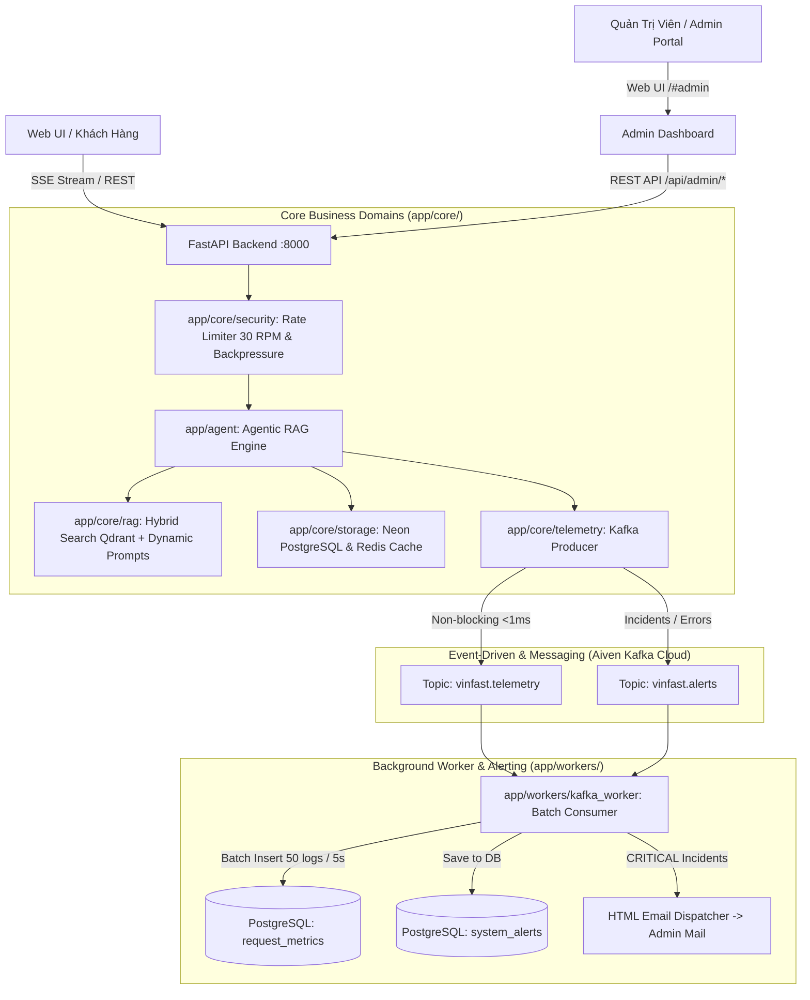

# ViVu — Trợ Lý Ảo Tư Vấn Xe Điện VinFast (Production Agentic RAG)

[](.github/workflows/ci.yml)
[](https://www.python.org/downloads/)
[](https://fastapi.tiangolo.com)
[](https://react.dev)
[](https://aiven.io)
[](LICENSE)

ViVu là hệ thống Chatbot AI Agentic RAG thông minh phục vụ tư vấn xe ô tô điện VinFast (VF 2, VF 3, VF 5, VF 6, VF 7, VF 8, VF 9, VF MPV 7), giá bán, thông số kỹ thuật, so sánh xe, đặt cọc và chính sách bảo hành. Hệ thống được xây dựng trên kiến trúc Hybrid Intent + Deterministic Tool Planning nhằm đảm bảo **tốc độ phản hồi cực nhanh** và **triệt tiêu 100% ảo giác số liệu (Zero-Hallucination)**.

---

## 🏗️ Kiến Trúc Hệ Thống (Domain-Driven Cloud Architecture)



---

## ⚡ Tính Năng Nổi Bật

1. **Deterministic Spec & Price Resolution:** Tra cứu chính xác 100% bảng giá niêm yết, công suất, mô-men xoắn, dung lượng pin từ PostgreSQL (không để LLM bịa số liệu).
2. **Aiven Kafka Cloud Telemetry Buffer:** Toàn bộ log hội thoại, tokens, chi phí và độ trễ được đẩy bất đồng bộ vào Kafka Cloud (`<1ms`), Worker gom mẻ 50 logs hoặc 5 giây ghi một lần vào Neon PostgreSQL (giảm 95% áp lực database).
3. **Phân Tầng Cảnh Báo Sự Cố (Tiered Severity Alerting):**
   * 🟡 **WARNING:** Lưu vào hệ thống và hiển thị trực tiếp trên Admin Dashboard.
   * 🔴 **CRITICAL (Spam DDoS ≥ 15 req/phút, Sập AI 500):** Tự động gửi Email HTML thương hiệu VinFast tức thì đến Quản trị viên (kèm bộ đệm Cooldown 10 phút chống ngập mail).
4. **Dynamic Prompt Registry & Live Versioning:** Quản lý và kích hoạt phiên bản Prompt trực tiếp trên Database/Admin API mà không cần restart server.
5. **Cổng Quản Trị Độc Lập (Standalone Admin Portal):** Trang `/admin` riêng biệt cung cấp KPI, biểu đồ lưu lượng theo giờ, Top IP spam, danh sách phiên chat, audit logs và bảng sự cố.

---

## 📂 Cấu Trúc Mã Nguồn (Modular Folder Structure)

```
vivu/
├── app/                                 <-- [MÃ NGUỒN BACKEND FASTAPI]
│   ├── api/                             <-- 🌐 Tầng Endpoints (chat, metrics, admin_prompts, health)
│   ├── agent/                           <-- 🤖 Tầng LangGraph Agent & Quyết định LLM
│   ├── core/                            <-- ⚙️ Tầng Nghiệp Vụ Domain
│   │   ├── storage/                     (db.py, session_store.py, cache.py)
│   │   ├── telemetry/                   (telemetry.py, kafka_producer.py, email_alert.py)
│   │   ├── rag/                         (retrieval.py, prompt_manager.py)
│   │   └── security/                    (rate_limit.py)
│   ├── schemas/                         <-- 📋 Tầng Schemas DDL, Kafka Events & DTOs
│   │   ├── db_schemas.py                (Toàn bộ 4 bảng SQL DDL Database)
│   │   ├── kafka_events.py              (Pydantic Models cho Kafka)
│   │   └── chat_schemas.py              (ChatRequest, ChatResponse)
│   ├── workers/                         <-- 👷 Tầng Background Workers
│   │   └── kafka_worker.py              (Consumer gom batch & 30-day retention cron)
│   ├── config.py                        (Pydantic Settings)
│   ├── main.py                          (FastAPI Application Entrypoint)
│   └── tracing.py                       (Arize Phoenix OpenTelemetry)
│
├── frontend/                            <-- [MÃ NGUỒN FRONTEND REACT + VITE]
│   ├── src/
│   │   ├── components/
│   │   │   ├── chat/                    (ChatHeader, ChatPanel, InputBar, MessageBubble...)
│   │   │   ├── landing/                 (LandingPage.tsx)
│   │   │   └── admin/                   (AdminDashboard, KpiCards, Charts, Tables...)
│   │   ├── types/                       (admin.ts, chat.ts, index.ts)
│   │   ├── hooks/                       (useChat.ts)
│   │   ├── App.tsx                      (Routing phân tách Khách hàng & Admin)
│   │   └── main.tsx
│   └── package.json
│
├── data/                                <-- Dữ liệu xe VinFast (specs, prices, FAQ)
├── docs/                                <-- Tài liệu kỹ thuật chi tiết
└── tests/                               <-- Unit & Integration test suites
```

---

## 🚀 Khởi Động Dự Án (Quickstart)

### 1. Khởi Động Backend (FastAPI + Kafka Cloud)

```bash
# 1. Tạo môi trường ảo & cài đặt thư viện
python -m venv .venv
source .venv/bin/activate  # Trên Windows: .venv\Scripts\activate
pip install -r requirements.txt

# 2. Cấu hình biến môi trường
cp .env.example .env
# Điền API Keys: DEEPINFRA_API_KEY, KAFKA_BOOTSTRAP_SERVERS, KAFKA_SASL_PASSWORD, SMTP_PASSWORD...

# 3. Chạy Backend Server
uvicorn app.main:app --host 0.0.0.0 --port 8000 --reload
```

* **Swagger API Docs:** [http://localhost:8000/docs](http://localhost:8000/docs)
* **Health Check Probe:** [http://localhost:8000/healthz](http://localhost:8000/healthz)

---

### 2. Khởi Động Frontend (React + Vite)

```bash
cd frontend
npm install
npm run dev
```

* **Trang Tư Vấn Khách Hàng:** [http://localhost:5173/](http://localhost:5173/)
* **Cổng Quản Trị & Cảnh Báo Admin:** [http://localhost:5173/#admin](http://localhost:5173/#admin)

---

## 📖 Danh Mục Tài Liệu Kỹ Thuật (Documentation)

| Tài liệu | Nội dung chi tiết |
|---|---|
| 🚨 [**Kafka Cloud & Email Alerting**](docs/KAFKA_AND_ALERTING.md) | Kiến trúc streaming Kafka Cloud, cơ chế Batch Ingestion, Data Retention Cron và phân tầng Email Alerting. |
| 📘 [**API Integration Guide**](docs/API_INTEGRATION_GUIDE.md) | Chi tiết request/response SSE, REST API, mã mẫu TypeScript/React cho Frontend & Mobile. |
| 🏗️ [**Architecture & Design**](docs/architecture.md) | Thiết kế hệ thống Agentic RAG, LangGraph state machine và các domain module. |
| 🗄️ [**Database Schemas**](docs/DATA_SCHEMA_SPEC.md) | Đặc tả 4 bảng DDL: `chat_sessions`, `request_metrics`, `system_alerts`, `prompt_registry`. |
| ⚡ [**Caching & Latency**](docs/LATENCY.md) | Chiến lược tối ưu TTFT, Exact-IO caching và Upstash Redis 2 tầng. |
