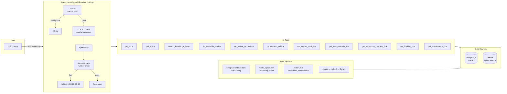
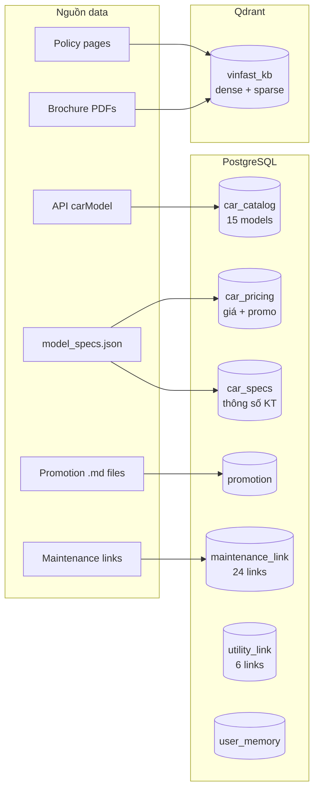
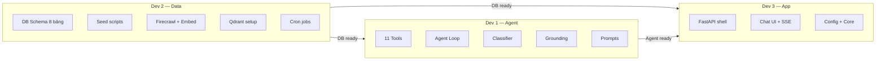
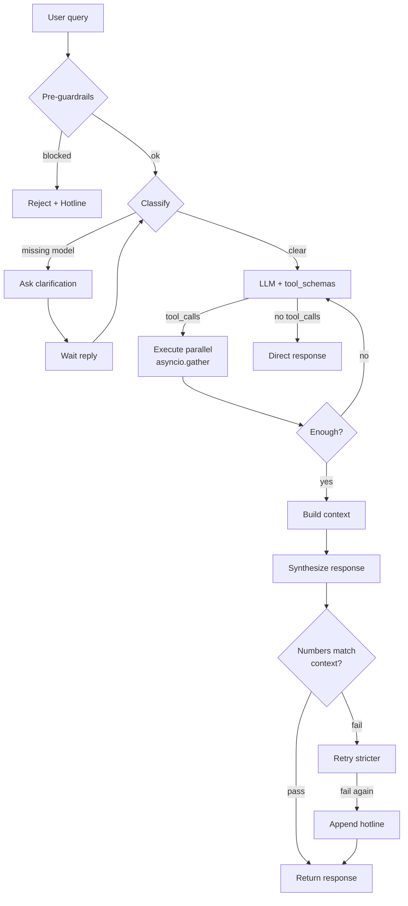
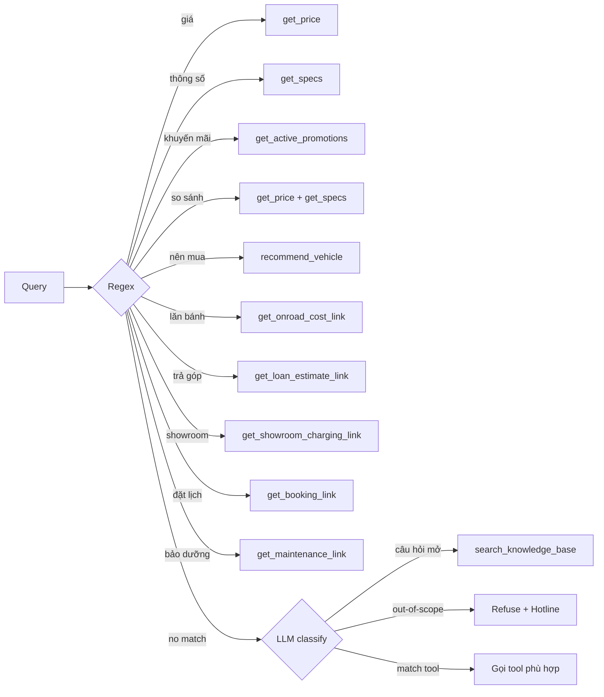

# Vivu — Agentic RAG Architecture

## Hệ thống tổng quan

```mermaid
flowchart LR
    subgraph User
        U[Khách hàng]
    end

    subgraph Agent["Agent Loop (OpenAI Function Calling)"]
        direction TB
        CLS[Classify<br/>regex + LLM] -->|ambiguous| ASK[Hỏi lại]
        CLS -->|clear| LOOP[LLM + 11 tools<br/>parallel execution]
        LOOP --> SYN[Synthesize]
        SYN --> GND[Groundedness<br/>number check]
        GND -->|fail| HOT[Hotline 1900 23 23 89]
        GND -->|pass| RESP[Response]
    end

    subgraph Tools["11 Tools"]
        direction TB
        T1[get_price]
        T2[get_specs]
        T3[search_knowledge_base]
        T4[list_available_models]
        T5[get_active_promotions]
        T6[recommend_vehicle]
        T7[get_onroad_cost_link]
        T8[get_loan_estimate_link]
        T9[get_showroom_charging_link]
        T10[get_booking_link]
        T11[get_maintenance_link]
    end

    subgraph Data["Data Sources"]
        direction TB
        PG[(PostgreSQL<br/>8 tables)]
        QD[(Qdrant<br/>hybrid search)]
    end

    subgraph Pipeline["Data Pipeline"]
        direction TB
        API[omapi.vinfastauto.com<br/>car catalog]
        JSON[model_specs.json<br/>3659 dòng specs]
        MD[data/*.md<br/>promotions, maintenance]
        EMBED[chunk → embed → Qdrant]
    end

    U -->|SSE streaming| Agent
    Agent --> Tools
    Tools --> Data
    Pipeline --> Data
```

## Data Flow

```mermaid
flowchart LR
    subgraph Input["Nguồn data"]
        A1[API carModel]
        A2[model_specs.json]
        A3[Promotion .md files]
        A4[Maintenance links]
        A5[Policy pages]
        A6[Brochure PDFs]
    end

    subgraph DB["PostgreSQL"]
        T1[(car_catalog<br/>15 models)]
        T2[(car_pricing<br/>giá + promo)]
        T3[(car_specs<br/>thông số KT)]
        T4[(promotion)]
        T5[(maintenance_link<br/>24 links)]
        T6[(utility_link<br/>6 links)]
        T7[(user_memory)]
    end

    subgraph VDB["Qdrant"]
        Q1[(vinfast_kb<br/>dense + sparse)]
    end

    A1 --> T1
    A2 --> T3
    A2 --> T2
    A3 --> T4
    A4 --> T5
    A5 --> Q1
    A6 --> Q1
```

## 3 Dev Split

```mermaid
flowchart LR
    subgraph D1["Dev 1 — Agent"]
        B1[11 Tools]
        B2[Agent Loop]
        B3[Classifier]
        B4[Grounding]
        B5[Prompts]
    end

    subgraph D2["Dev 2 — Data"]
        A1[DB Schema 8 bảng]
        A2[Seed scripts]
        A3[Firecrawl + Embed]
        A4[Qdrant setup]
        A5[Cron jobs]
    end

    subgraph D3["Dev 3 — App"]
        C1[FastAPI shell]
        C2[Chat UI + SSE]
        C3[Config + Core]
    end

    D2 -->|DB ready| D1
    D2 -->|DB ready| D3
    D1 -->|Agent ready| D3
```

## Agent Loop chi tiết

```mermaid
flowchart TD
    Q[User query] --> PRE{Pre-guardrails}
    PRE -->|blocked| REJECT[Reject + Hotline]
    PRE -->|ok| CLS{Classify}

    CLS -->|missing model| CLARIFY[Ask clarification]
    CLARIFY --> WAIT[Wait reply] --> CLS

    CLS -->|clear| LLM[LLM + tool_schemas]
    LLM -->|tool_calls| EXEC[Execute parallel<br/>asyncio.gather]
    EXEC --> EVAL{Enough?}
    EVAL -->|no| LLM
    EVAL -->|yes| CTX[Build context]

    CTX --> SYN[Synthesize response]
    SYN --> GND{Numbers match<br/>context?}
    GND -->|fail| STRicter[Retry stricter]
    STRicter -->|fail again| HOTLINE[Append hotline]
    GND -->|pass| DONE[Return response]
    HOTLINE --> DONE

    LLM -->|no tool_calls| DONE2[Direct response]
```

## Tool Routing

```mermaid
flowchart LR
    Q[Query] --> R{Regex}
    R -->|giá| T1[get_price]
    R -->|thông số| T2[get_specs]
    R -->|khuyến mãi| T5[get_active_promotions]
    R -->|so sánh| CMP[get_price + get_specs]
    R -->|nên mua| T6[recommend_vehicle]
    R -->|lăn bánh| T7[get_onroad_cost_link]
    R -->|trả góp| T8[get_loan_estimate_link]
    R -->|showroom| T9[get_showroom_charging_link]
    R -->|đặt lịch| T10[get_booking_link]
    R -->|bảo dưỡng| T11[get_maintenance_link]
    R -->|no match| LLM{LLM classify}
    LLM -->|câu hỏi mở| T3[search_knowledge_base]
    LLM -->|out-of-scope| REF[Refuse + Hotline]
    LLM -->|match tool| TOOLS[Gọi tool phù hợp]
```
