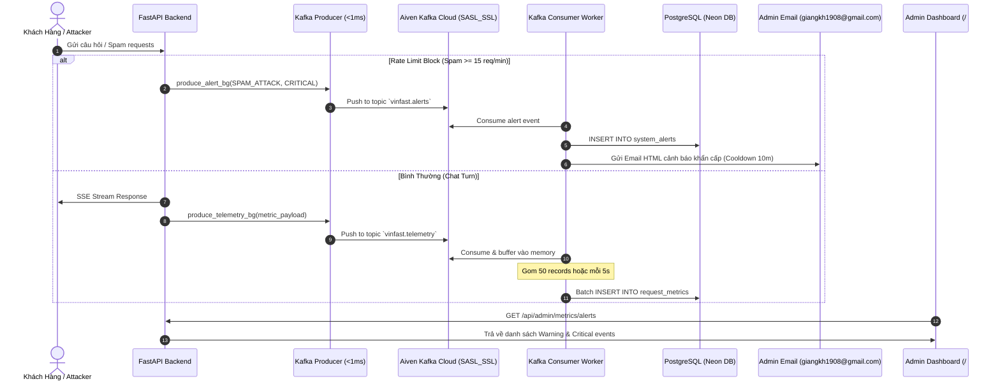

# Kiến Trúc Kafka Cloud & Hệ Thống Cảnh Báo Phân Tầng (Tiered Email Alerting)

Tài liệu này đặc tả chi tiết kiến trúc Message Streaming qua **Aiven Kafka Cloud**, cơ chế **Hàng đợi Ghi Log Gom Mẻ (Batch Ingestion)** và **Hệ thống Cảnh báo Sự cố Phân tầng qua Email HTML**.

---

## 1. Tổng Quan Kiến Trúc (Architecture Overview)

---

## 2. Thiết Lập Kafka Cloud (Aiven Apache Kafka 4.2)

### A. Cấu Hình Kết Nối (.env)
* **Bootstrap Server:** `vinfast-kafka-giangkh1908-1eb5.j.aivencloud.com:18877`
* **Security Protocol:** `SASL_SSL`
* **SASL Mechanism:** `SCRAM-SHA-256`
* **Username:** `avnadmin`
* **SSL Bypass:** Tự động thiết lập `ssl.CERT_NONE` trong `aiokafka` để tương thích với chứng chỉ Cloud của Aiven.

### B. Topics Thiết Lập:
1. `vinfast.telemetry`: Chứa dữ liệu đo lường từng turn chat (Tokens, Độ trễ, TTFT, Cost, Cache Hit/Miss, IP).
2. `vinfast.alerts`: Chứa các sự kiện cảnh báo sự cố từ middleware và agent loop.

---

## 3. Hàng Đợi Ghi Log Batch Ingestion (`app/workers/kafka_worker.py`)

* **Mục đích:** Giảm thiểu 95% số lượng câu lệnh `INSERT` đơn lẻ vào Neon PostgreSQL serverless.
* **Cơ chế:**
  1. Khi nhận tin nhắn từ `vinfast.telemetry`, tin nhắn được đưa vào `_telemetry_buffer`.
  2. Khi bộ đệm đạt **50 records** hoặc cứ sau **5 giây**, worker thực hiện `executemany` trong 1 transaction duy nhất.
* **Data Retention Cron:** Định kỳ mỗi 24 giờ, worker tự động chạy câu lệnh xóa các bản ghi telemetry và alerts cũ hơn 30 ngày để đảm bảo dung lượng Database luôn ổn định.

---

## 4. Phân Tầng Mức Độ Cảnh Báo (Tiered Severity Alerting)

Để bảo vệ hộp thư của Quản trị viên khỏi tình trạng ngập lụt spam:

| Mức Độ (Severity) | Tiêu Chí Phát Sinh | Hành Động Xử Lý | Gửi Email? |
|---|---|---|---|
| 🟡 **WARNING** | - Vi phạm Rate limit 1–14 lần. - Cảnh báo tải tăng nhẹ. - Latency turn chat cao bất thường. | Ghi vào bảng `system_alerts` và hiển thị trên Admin Dashboard. | ❌ **Không** |
| 🔴 **CRITICAL** | - Tấn công Spam/DDoS: IP vi phạm rate limit $\ge 15$ lần/phút. - Sự cố sập AI Chatbot (HTTP 500 / Exception). - Chi phí Token vượt ngưỡng ngân sách. | Ghi vào `system_alerts` + Hiển thị Admin Dashboard + 🚨 **Gửi Email HTML Khẩn Cấp**. | ✅ **Có** (Email tức thì) |

### Cơ Chế Cooldown Chống Spam Mail:
* Mỗi loại sự cố (ví dụ: cùng 1 IP spam) sẽ được áp dụng **Cooldown 10 phút**.
* Trong vòng 10 phút, nếu sự cố tiếp diễn, hệ thống chỉ lưu Log trên Dashboard mà không gửi thêm email, tránh làm phiền hòm thư.

---

## 5. Mẫu Email Cảnh Báo Nhận Diện Thương Hiệu VinFast AI

Email cảnh báo được render dưới dạng HTML hiện đại và định dạng người gửi chuẩn RFC 5322:
* **Tên người gửi (From Name):** `VinFast AI Alerts <quangvu1922@gmail.com>` (Tùy biến qua biến môi trường `SMTP_FROM_NAME`).
* **Header:** Logo VinFast + Tiêu đề màu Đỏ cảnh báo khẩn cấp.
* **Metadata Table:** Hiển thị Mã sự cố, Thời gian chính xác (Giờ VN), IP thủ phạm, Tóm tắt lỗi.
* **JSON Payload Box:** Chi tiết kỹ thuật của request để DevOps có thể debug ngay lập tức.
* **Footer:** Thông tin hệ thống tự động ViVu VinFast Chatbot.

---

## 6. Cơ Chế Ghi Nhận Tức Thì & Kiểm Thử Admin Dashboard

### A. Ghi Nhận Song Song Tức Thì (Zero Latency Logging)
* Khi mỗi turn chat hoặc cảnh báo phát sinh, hệ thống thực hiện đồng thời:
  1. Ghi trực tiếp bản ghi vào Neon PostgreSQL (`request_metrics` / `system_alerts`) qua background task (<5ms) -> Admin Dashboard thấy ngay lập tức.
  2. Bắn Message Event vào Aiven Kafka Cloud để phục vụ streaming phân tích dữ liệu mở rộng.
  3. Sử dụng `ON CONFLICT (request_id) DO NOTHING` để đảm bảo chống trùng lặp dữ liệu tuyệt đối (Zero Duplication).

### B. Kiểm Thử Trực Tiếp Từ Giao Diện Admin
Quản trị viên có thể truy cập `http://localhost:5173/#admin` -> Tab **`🔔 Cảnh Báo Hệ Thống`**:
* Bấm **"Test Warning Event"**: Gửi sự kiện giả lập Warning -> Bảng hiển thị ngay dòng màu vàng.
* Bấm **"Test Gửi Email Critical"**: Gửi sự kiện Critical (tự động bỏ qua cooldown) -> Ghi bảng + **Gửi Email HTML tức thì với tên `VinFast AI Alerts` tới `giangkh1908@gmail.com`**.
